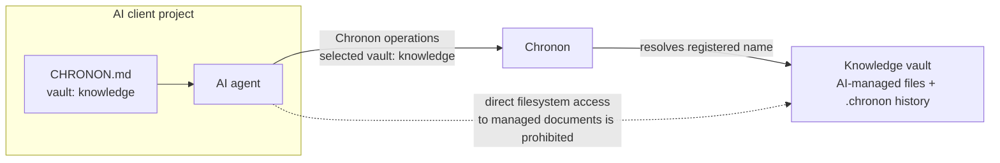

# Chronon

Chronon is local version control for text documents managed by AI, especially
Markdown files. Each tracked file gets its own linear, immutable timeline,
time-based lookup, and structural diffs for YAML and JSON. It works alongside
Git but neither calls nor replaces it.

Chronon can be used in three ways:

- by a person through the `chronon` CLI;
- by an AI agent through the same CLI, guided by a generated `CHRONON.md`; or
- by an AI client through the local stdio MCP server, `chronon-mcp`.

> **Project status:** alpha. Manual commit mode is implemented. `--mode auto` is
> reserved but intentionally returns `not_implemented`. Before relying on
> Chronon as the only copy of important history, read [Data and backups](#data-and-backups).

## Overview

Instead of letting an agent edit a document directly and lose the context of the
change, Chronon gives each managed file its own immutable history, working
state, diff, validation, and explicit commit. This history is local and
independent of the surrounding Git repository.

Every commit requires a non-empty message. The message records why a person or
AI made the change, so the history remains meaningful to both future agents and
human reviewers. Chronon also allows limited scratch edits before a commit, so
an agent can gather related changes, inspect the diff, and then record them
together with one meaningful message.

A **vault** is the named collection of files an AI project is configured to
manage. It is an initialized Chronon repository registered in the user's vault
registry. A user can register any number of vaults, such as `knowledge`,
`research`, or `product-docs`. The name selects that collection without exposing
its filesystem path or requiring the AI client to run inside the vault directory.

From a separate AI client project that is not itself a vault, run
`chronon agent-setup --vault knowledge`. Chronon writes vault-specific guidance
that selects `knowledge` as that project's target vault. The agent then manages
that vault's documents through Chronon rather than direct filesystem operations.



For a vault-configured AI workspace, the agent reads and writes managed files
only through Chronon. The generated guidance prohibits direct filesystem access
to the vault's raw files, so every AI change keeps its tracking, revision
checks, scratch safety, and history. This is a tool-use boundary for the AI
agent, not an operating-system access-control boundary: a person with
filesystem permissions can still open the vault files directly.

## Requirements

- Python 3.11 or newer
- Windows 10/11, Linux, WSL2, or macOS
- Text files; YAML, JSON, Markdown, and plain text are the primary formats. UTF-8
  is the default and assumed encoding; other encodings are read and stored
  losslessly (byte-exact through the CLI, while MCP reads of non-UTF-8 content
  are flagged `lossy`)

## Installation

Chronon is a Python CLI, so the supported installers are the ones that give a
CLI its own isolated environment and put its commands on `PATH`:
[`uv`](https://docs.astral.sh/uv/) or
[`pipx`](https://pipx.pypa.io/latest/how-to/install-pipx.html). Both install
commands into a per-user directory (`~/.local/bin` on macOS/Linux). Running
`uv tool update-shell` or `pipx ensurepath` once adds that directory to `PATH`;
open a new terminal afterwards.

The package name is `chronon-vcs`; the installed commands are:

```text
chronon
chronon-mcp
```

`chronon` is the entry point for people and shell-based automation. For AI
clients, prefer `chronon-mcp`: it exposes Chronon as structured MCP tools and
avoids parsing shell output. Use the CLI when the client cannot use MCP.

### From PyPI (recommended)

Install the published package:

```bash
uv tool install chronon-vcs
# or
pipx install chronon-vcs
```

Upgrade with `uv tool upgrade chronon-vcs` or `pipx upgrade chronon-vcs`.

### From GitHub

No clone is required. Install a released tag directly:

```bash
uv tool install "git+https://github.com/Hybrid3D/chronon@v0.2.2"
# or
pipx install "git+https://github.com/Hybrid3D/chronon@v0.2.2"

chronon --version
```

Pinning a tag is deliberate: it is the difference between a reproducible
install and whatever `main` happens to contain. Omit `@v0.2.2` only if you
intentionally want the development branch.

To move to a newer tag, install again with the new tag and `--force`
(`uv tool install --force …`) or `pipx install --force …`.

Every tag also publishes a built wheel and sdist on the
[releases page](https://github.com/Hybrid3D/chronon/releases), which can be
installed offline:

```bash
pipx install ./chronon_vcs-0.2.2-py3-none-any.whl
```

### Platform prerequisites

Only the installer bootstrap differs per platform; the `uv tool install` or
`pipx install` command above is the same everywhere.

**macOS**

```bash
brew install python pipx
pipx ensurepath
```

**Linux** — Ubuntu 23.04+/Debian 12+ use `sudo apt install pipx`; Fedora uses
`sudo dnf install pipx`. Then run `pipx ensurepath` and open a new shell.

Do not install into an OS-managed Python with `sudo pip`. On distributions that
enforce PEP 668, use the distribution's pipx package or the alternatives in the
[official pipx instructions](https://pipx.pypa.io/latest/how-to/install-pipx.html).

**WSL2** — use the Linux instructions inside WSL, even if Python or pipx is
also installed on Windows. Keep the Chronon installation and active vault on the
same side of the Windows/WSL boundary. For the best filesystem behavior and
performance, a path below the WSL home directory (for example `~/vaults/notes`)
is preferable to `/mnt/c/...`.

**Windows (PowerShell)** — install Python 3.11+ from
[python.org](https://www.python.org/downloads/windows/), enabling the installer
option that makes the Python launcher available, then:

```powershell
py -m pip install --user pipx
py -m pipx ensurepath
# Close and reopen PowerShell, then:
pipx install "git+https://github.com/Hybrid3D/chronon@v0.2.2"
chronon --version
```

If `pipx` is still not found after reopening PowerShell, follow the PATH step in
the [official Windows pipx instructions](https://pipx.pypa.io/latest/how-to/install-pipx.html#windows).

### From a local checkout

For contributors, or to try an unreleased change:

```bash
git clone https://github.com/Hybrid3D/chronon
cd chronon
pipx install --force .     # or: pip install -e ".[dev]" for development
```

### Uninstalling

```bash
uv tool uninstall chronon-vcs    # or: pipx uninstall chronon-vcs
```

Uninstalling removes the commands only. Vault contents, `.chronon/` history,
and the vault registry are left in place.

## Quick start

Initialize a directory and register a global name for it in one operation:

```bash
mkdir -p "$HOME/Documents/my-notes"
chronon init "$HOME/Documents/my-notes" --register notes
```

On PowerShell:

```powershell
New-Item -ItemType Directory -Force "$HOME\Documents\my-notes"
chronon init "$HOME\Documents\my-notes" --register notes
```

Create a file using any editor, start tracking it, observe its revision token,
and make the first commit:

```bash
printf 'title: First note\nstatus: draft\n' > "$HOME/Documents/my-notes/note.yml"
chronon --vault notes add note.yml
chronon --vault notes status note.yml --json
chronon --vault notes commit note.yml \
  --message "add first note" \
  --if-match '<working_revision from status>'
```

PowerShell equivalent for the file creation step:

```powershell
@"
title: First note
status: draft
"@ | Set-Content -Encoding utf8 "$HOME\Documents\my-notes\note.yml"
```

The `working_revision` value is an opaque compare-and-swap token. Passing it to
`--if-match` prevents a person or another agent from overwriting content that
changed after it was read.

## Working from a different directory

Vault registration is designed for this case. The initialization target does
not have to be the current directory:

```bash
cd "$HOME/work/client-app"

# Initialize a separate directory and register it as "knowledge".
chronon init "$HOME/Documents/team-knowledge" \
  --register knowledge

# Create vault-specific AI guidance in the current external workspace.
chronon agent-setup --vault knowledge

chronon list-vaults
chronon --vault knowledge status
chronon --vault knowledge ls -l
```

The global `--vault`/`-v` option is accepted before or after the subcommand:

```bash
chronon --vault knowledge diff architecture.yml
chronon log architecture.yml -v knowledge
```

Without a vault option, Chronon searches upward from the current directory for
the nearest `.chronon/config.toml`, similar to Git repository discovery.

### Vault registry location

Vault names are per-user, not stored inside a vault:

- Windows: `%APPDATA%\chronon\vaults.toml`
- Linux, WSL, and macOS: `$XDG_CONFIG_HOME/chronon/vaults.toml` when
  `XDG_CONFIG_HOME` is set, otherwise `~/.config/chronon/vaults.toml`

Set `CHRONON_CONFIG_HOME` to override the directory on any platform. This is
also useful for isolated tests and automation.

```bash
chronon add-vault work /absolute/path/to/an/initialized/repository
chronon list-vaults
chronon remove-vault work  # removes only the name; files and history remain
```

## Everyday CLI workflow

### Track and commit an existing file

```bash
chronon add config.yml
chronon status config.yml --json
chronon commit config.yml -m "track initial configuration" \
  --if-match '<working_revision>'
```

`add` begins tracking; there is no staging area. A commit snapshots exactly one
file and always requires a message. The state name `untracked` is retained for
compatibility and means “tracked by Chronon but with zero commits,” not that
`add` failed.

### Make a structured change

```bash
chronon status config.yml --json
chronon set config.yml \
  --path servers.web.port \
  --value 9090 \
  --type int \
  --message "move web service to port 9090" \
  --if-match '<working_revision>'

chronon diff config.yml --from latest~1 --to latest
chronon path-history config.yml servers.web.port
```

Supported value types are inferred as YAML by default, or can be selected with
`--type str|int|float|bool|null|json`. `set` and `unset` work on YAML and JSON.

### Replace complete content

For a tracked file, provide exactly one content source:

```bash
chronon write note.md --content '# New text' -m "replace note"
chronon write note.md --file prepared-note.md -m "replace from prepared file"
printf '# Generated text\n' | chronon write note.md --stdin -m "replace note"
```

When the current state is `dirty`, include the revision returned by the preceding
read or status:

```bash
revision=$(chronon status note.md --json | python -c \
  'import json,sys; print(json.load(sys.stdin)["working_revision"])')
printf '# Final text\n' | chronon write note.md --stdin -m "finish note" \
  --if-match "$revision"
```

`chronon write` also creates a missing path and starts tracking it in one
operation:

```bash
printf 'first line\n' | chronon write notes/new.txt --stdin --scratch
chronon read notes/new.txt --json
chronon commit notes/new.txt -m "add note" --if-match '<working_revision>'
```

`chronon write` refuses to overwrite an existing untracked path.

### Normal editor and external changes

An edit made outside Chronon is reported as `foreign`. The content is not lost
or automatically accepted.

To commit exactly the external content you inspected:

```bash
chronon status config.yml --json
chronon validate config.yml
chronon commit config.yml -m "accept reviewed editor change" \
  --if-match '<working_revision>'
```

To accept it as an uncommitted Chronon baseline and continue editing:

```bash
chronon accept config.yml --if-match '<working_revision>'
chronon status config.yml --json  # read the new token before another write
```

To discard changes and restore the latest commit:

```bash
chronon discard config.yml --if-match '<working_revision>'
chronon discard config.yml --force --if-match '<working_revision>'  # foreign too
```

`--force` may destroy an external edit. A supplied revision is always checked.

### Move, copy, inspect, and restore

```bash
chronon mv docs.yml config/web.yml
chronon cp config/web.yml config/web.example.yml

chronon log config/web.yml
chronon show config/web.yml 1
chronon diff config/web.yml --from 1 --to working --format both
chronon rollback config/web.yml 1 -m "restore original settings" \
  --if-match '<working_revision>'
```

- `mv` preserves the resource ID, full history, path timeline, and schema.
- `cp` creates a new resource ID and empty history, while recording its origin.
- `rollback` restores old content as a new commit; it does not rewrite history.
- If a tracked working file is deleted, `status` reports `missing` and `discard`
  can restore its latest committed content.

### Revisions and diffs

Accepted revision specifications:

```text
1
working
latest
latest~3
2026-08-01
2026-08-01T13:30:00+09:00
7d ago
3h ago
30m ago
```

A date without a time means UTC midnight. YAML and JSON use structural diff by
default, so key ordering and indentation-only changes disappear. Other text
files use a unified text diff. `--format` accepts `auto`, `structural`, `text`,
or `both`.

### Validation with JSON Schema

```bash
chronon schema-register config.json --file config.schema.json
chronon validate config.json
```

The schema itself must be valid JSON Schema 2020-12, and registration fails if
the current document does not satisfy it. Future Chronon writes are validated
before the working file is replaced.

## CLI command reference

Run `chronon COMMAND --help` for every option.

| Command | Purpose |
|---|---|
| `init [DIR]` | Initialize a manual repository and optionally register a vault |
| `add FILE...` | Start tracking existing files |
| `status [FILE]` | Show one or all states: `untracked`, `clean`, `dirty`, `foreign`, `missing` |
| `list` | List all tracked resources and states |
| `ls [DIR]` | List immediate tracked children |
| `read FILE` | Read working or historical content |
| `show FILE REV` | Read one historical revision |
| `write FILE` | Replace an existing tracked working copy, optionally committing it |
| `commit FILE` | Commit exactly one working copy |
| `set FILE` / `unset FILE` | Change a YAML/JSON path |
| `diff FILE` | Compare two revisions |
| `log FILE` | List immutable commits, newest first |
| `path-history FILE PATH` | Show commits that changed one structured value |
| `mv SRC DST` | Rename while preserving identity and history |
| `cp SRC DST` | Copy into a new independent resource |
| `rollback FILE REV` | Restore a revision as a new commit |
| `discard FILE` | Restore the latest committed content |
| `accept FILE` | Accept a foreign edit as the current dirty baseline |
| `schema-register FILE` | Attach a JSON Schema |
| `validate FILE` | Validate current content |
| `agent-setup [PATH]` | Create or refresh CHRONON.md and point the workspace's AI instruction files at it (`--permissions` to allowlist safe commands, `--check` to verify only) |
| `add-vault`, `list-vaults`, `remove-vault` | Manage global vault names |

Use `chronon --version` (or `chronon -V`) to print the installed version. Add
`--json` for machine-readable output. Domain errors also become JSON and
include a stable `error` code. Common exit codes are: `1` for a failed check,
`3` for repository/file lookup, `4` for invalid arguments, `5` for nothing to
commit, `6` for protected foreign changes, `7` for a missing/stale precondition,
and `8` when no state exists at a requested revision.

## Using Chronon with an AI through `CHRONON.md`

`chronon agent-setup` writes `CHRONON.md` in the current directory and links it
from the AI instruction files that workspace already uses. The current directory
does not need to be a vault; normally it is the project or agent workspace from
which a separate vault will be used:

```bash
cd "$HOME/work/client-app"
chronon agent-setup --vault knowledge
```

Pass a directory to set up that directory instead:

```bash
chronon agent-setup "$HOME/work/client-app" --vault knowledge
```

Both steps are idempotent, so this is also the upgrade command: re-run it after
installing a new Chronon version to refresh the generated guidance in place. See
[How your agent loads `CHRONON.md`](#how-your-agent-loads-chrononmd) for the
linking rules.

`agent-setup` deliberately generates one of two target-selection variants.

### Generic `CHRONON.md` (no fixed vault)

Without `--vault`, the guide tells the agent to use an explicitly named vault
when the user supplies one, to rely on working-directory discovery when already
inside a vault, and never to guess a vault name:

```bash
chronon agent-setup
chronon agent-setup "$HOME/work/client-app"
```

### Vault-specific `CHRONON.md`

With `--vault`, the guide fixes one registered vault as the target:

```bash
chronon agent-setup --vault knowledge
chronon agent-setup "$HOME/work/client-app" --vault knowledge
```

The specialized template names `knowledge` in every relevant example. MCP calls
use `vault="knowledge"`; CLI commands use `chronon --vault knowledge`. The agent
must not substitute a different target unless the user explicitly changes it.

Both variants work with or without MCP. The generated instructions establish
this interface order:

1. If the client exposes Chronon MCP tools, use those tools for the entire task.
2. Otherwise use the `chronon` CLI as a fallback.
3. Do not mix MCP and CLI during one write flow.

The MCP and CLI sections describe the same safety workflow. Read first, retain
`working_revision`, and pass it as MCP `expected_revision` or CLI `--if-match`
when mutating. An MCP result with an `error` field is treated as a failed
operation. Managed resources are not edited through direct filesystem tools.

The generated section also explains scratch safety, revision preconditions,
commits, and structured edits. It is bounded by these markers:

```html
<!-- chronon:agents-md:begin -->
<!-- chronon:agents-md:end -->
```

Re-running `agent-setup` updates only that section and preserves everything else
in the file. You can prepend project-specific instructions, for example:

```markdown
# Knowledge vault instructions

- Preserve the existing document language and headings.
- Validate YAML before committing it.
- Use concise commit messages that describe the content change.
```

### How your agent loads `CHRONON.md`

`CHRONON.md` is not a filename AI clients look for on their own, so `agent-setup`
also writes a short pointer block into the instruction files they *do* load. One
command produces a working setup:

```console
$ chronon agent-setup --vault knowledge
Created /home/me/work/client-app/CHRONON.md
Updated /home/me/work/client-app/CLAUDE.md -> CHRONON.md
```

Targets are chosen like this:

- every known instruction file that already exists — `CLAUDE.md`, `AGENTS.md`,
  `GEMINI.md`, `.github/copilot-instructions.md`;
- otherwise `AGENTS.md`, the filename read by the widest set of clients.

Override the choice with `--link` (repeatable), or skip the step entirely with
`--no-link`:

```bash
chronon agent-setup --link CLAUDE.md --link .github/copilot-instructions.md
chronon agent-setup --no-link
```

### Approving Chronon commands once

By default an agent asks before every `chronon` invocation, which is noise
rather than safety for commands that change nothing or leave an undoable
revision. `--permissions` allowlists those in Claude Code's local settings:

```bash
chronon agent-setup --vault knowledge --permissions
```

This merges rules into `.claude/settings.local.json` — the personal, normally
git-ignored file — leaving every other key, and any existing `deny` rule,
exactly as it was. A rule that an existing `deny` covers is reported and never
added.

Allowlisted:

- read-only: `read` `show` `status` `list` `ls` `log` `diff` `path-history`
  `validate` `list-vaults`
- recoverable writes: `add` `write` `commit` `set` `unset` `mv` `cp` `rollback`
  `schema-register` — each leaves a commit that `log`/`diff` can inspect and
  `rollback` can undo

Deliberately **not** allowlisted, so these still stop for approval: `discard`
(destroys uncommitted work no history can restore), `accept` (adopts an edit
Chronon flagged on purpose), and `init` / `add-vault` / `remove-vault` (reshape
the repository or the per-user vault registry).

When `--vault` is given, each command is allowlisted in both
`chronon <command>` and `chronon --vault <name> <command>` form, because the
generated guidance puts the selector before the subcommand.

The flag is opt-in: `agent-setup` without it never touches your settings.

### Checking without writing

`--check` writes nothing. It reports each file as `current`, `stale`, or
`missing`, and exits `1` if a refresh would change anything. Add
`--permissions` to include the allowlist in the check:

```console
$ chronon agent-setup --check --vault knowledge
stale    /home/me/work/client-app/CHRONON.md
current  /home/me/work/client-app/CLAUDE.md -> CHRONON.md
chronon: agent instructions are out of date; run 'chronon agent-setup' to refresh them
```

This is the sweep to run after upgrading Chronon, since a workspace set up by an
older version keeps generated text that no longer matches the CLI. It also
catches a generated block that someone edited by hand, which makes it usable as
a CI guard:

```bash
for workspace in ~/work/*/; do
  chronon agent-setup --check "$workspace" >/dev/null || echo "needs refresh: $workspace"
done
```

In `CLAUDE.md` the pointer uses Claude Code's `@CHRONON.md` import syntax, so
the guide is loaded rather than merely mentioned. Other files get a Markdown
link. Either way the block is bounded by its own markers:

```html
<!-- chronon:link:begin -->
<!-- chronon:link:end -->
```

so re-running `agent-setup` refreshes the pointer and leaves the rest of your
instructions untouched.

**Do not copy the Chronon workflow into `CLAUDE.md` or `AGENTS.md` by hand.**
That is the one setup that breaks silently: the generated `CHRONON.md` is
refreshed on every upgrade, a hand-written copy is not, and the agent then reads
commands that no longer exist. Keep project-specific content rules in your own
instruction file and let `CHRONON.md` own the Chronon workflow.

Codex reads `AGENTS.md` automatically, so the generated pointer is enough. It
checks `AGENTS.override.md`, then `AGENTS.md`, then configured fallback names,
and loads at most one file per directory — which is why linking from an existing
`AGENTS.md` is safer than registering `CHRONON.md` as a fallback filename. See
the [official Codex instruction discovery documentation](https://developers.openai.com/codex/guides/agents-md).

For a client without persistent instruction-file discovery, attach
`CHRONON.md`, name its absolute path, or mention it explicitly in the prompt. A
complete prompt can be:

```text
First read CHRONON.md and follow it. Inspect architecture.yml, update the web
port to 9090, validate it, review the diff, and commit the change with a concise
message. If a decision is not material, use your recommended default and record
the assumption in decisions.md.
```

A well-behaved agent should follow this sequence:

1. Choose Chronon MCP when available; otherwise choose the CLI and stay with it.
2. Select the user-named vault, or use working-directory discovery when no
   vault name was supplied. Never guess.
3. Read status or content and retain `working_revision`.
4. Make the smallest valid change.
5. Pass the retained token as MCP `expected_revision` or CLI `--if-match`.
6. Inspect the diff and validate.
7. Commit with a meaningful message; never leave important work only as scratch.
8. On `revision_conflict`, re-read and reconcile instead of retrying blindly.

## Using Chronon with an AI through MCP

`chronon-mcp` is a local stdio MCP server. The MCP host launches it as a child
process; it is not a web service and should not be started in a terminal for
interactive use. A generic client configuration is:

```json
{
  "mcpServers": {
    "chronon": {
      "command": "/absolute/path/to/chronon-mcp",
      "args": []
    }
  }
}
```

Find the executable after pipx installation:

```bash
command -v chronon-mcp
```

```powershell
(Get-Command chronon-mcp).Source
```

An absolute command path is recommended for GUI clients, which often inherit a
smaller `PATH` than a terminal. Each repository tool accepts an optional `vault`
name, so one server can work with registered vaults regardless of its startup
directory.

The MCP surface supports the full working flow:

- setup: `initialize_repository`, `list_vaults`, `add_vault`, `remove_vault`,
  `write_agent_instructions`;
- discovery/read: `list_resources`, `list_directory`, `status_resource`,
  `read_resource`, `diff_resource`, `history_resource`, `path_history`;
- write: `put_resource`, `add_resource`, `write_resource`, `set_value`,
  `unset_value`, `commit_resource`, `move_resource`, `copy_resource`;
- recovery/validation: `rollback_resource`, `discard_changes`,
  `accept_foreign`, `validate_resource`, `register_schema`.

MCP tools return domain failures as structured objects with an `error` field.
Agents should treat that field as failure even when the MCP transport call itself
succeeds. For concurrent safety, read first and pass `working_revision` as
`expected_revision` on later mutations.

The default stdio behavior follows the
[official MCP Python SDK transport guidance](https://github.com/modelcontextprotocol/python-sdk/blob/main/docs/run/index.md).

## Data and backups

Initialization creates:

```text
.chronon/
├── config.toml
├── locks/
├── resources/        # descriptor, state, commit index, immutable snapshots
└── schemas/
```

Chronon adds `/.chronon/` to the vault's `.gitignore`. Therefore Chronon history
is local by default and is **not** pushed with the surrounding Git repository.
Back up the working files and their `.chronon` directory together if the history
matters. Chronon does not encrypt content; snapshots contain the same sensitive
text as the working document.

Resource writes are atomic, and per-resource operations plus vault-registry
updates use inter-process locks on Windows, Linux, WSL, and macOS. A commit is
file-scoped; there is no atomic multi-file transaction.

## Development and tests

Create an isolated environment from the repository root:

```bash
python3 -m venv .venv
source .venv/bin/activate        # Windows: .venv\Scripts\Activate.ps1
python -m pip install -e '.[dev]'
```

Run the same checks used by CI:

```bash
python -m ruff check .
python -m ruff format --check .
python -m pytest --cov=chronon --cov-report=term-missing
python -m pip_audit . --skip-editable
python -m build
python -m twine check dist/*
```

The GitHub Actions workflow tests Python 3.11–3.14, including native Windows and
macOS jobs, enforces branch-aware coverage, checks formatting and dependencies,
tests the declared minimum dependency versions, builds both wheel and source
distributions, and installs the built wheel for a smoke test. See
[CONTRIBUTING.md](CONTRIBUTING.md) for the test layout.

## License

[MIT](LICENSE)
